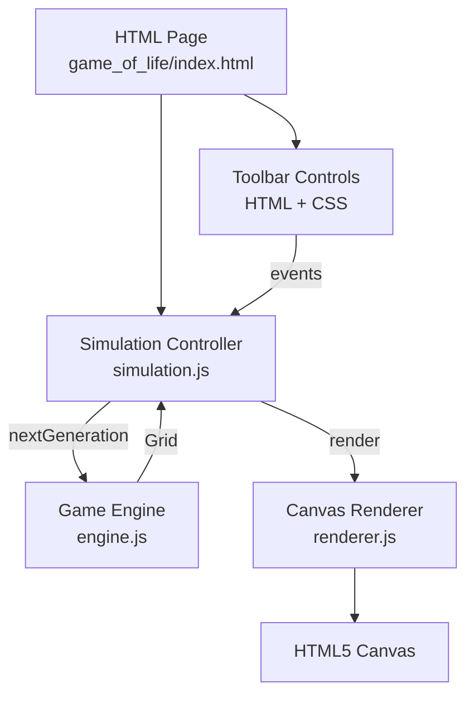
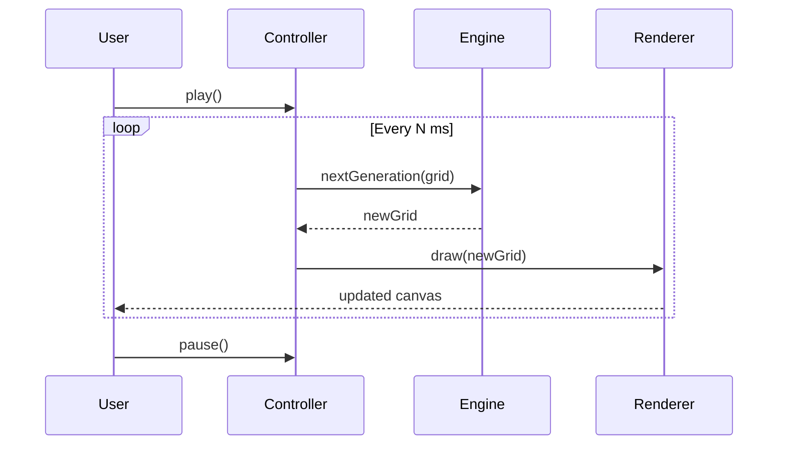
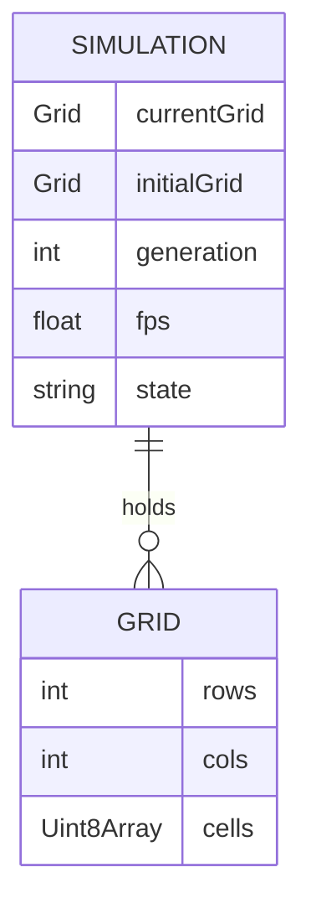
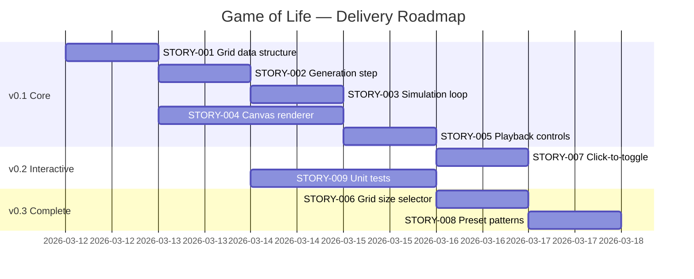

# Game of Life — Project Plan

> Generated: 2026-03-12
> Stack: Vanilla HTML5 / CSS3 / JavaScript (ES6+), hosted on GitHub Pages
> Approach: Solo Kanban + AI-Assisted Development

---

## Table of Contents

1. [Requirements & Backlog](#requirements--backlog)
2. [Kanban Board Design](#kanban-board-design)
3. [System Architecture](#system-architecture)
4. [Technical Design Specifications](#technical-design-specifications)
5. [Release Roadmap](#release-roadmap)
6. [Definition of Ready](#definition-of-ready)
7. [Definition of Done](#definition-of-done)
8. [Risk Register](#risk-register)
9. [ADR Log](#adr-log)

---

## Requirements & Backlog

### Epics

| Epic | Description | Stories |
|------|-------------|---------|
| Core Engine | Pure game logic: grid state, rules, generation stepping | STORY-001, STORY-002, STORY-003 |
| UI & Rendering | Grid display, controls, animations | STORY-004, STORY-005, STORY-006 |
| Input & Presets | Cell editing, text import, preset patterns | STORY-007, STORY-008 |
| Testing | Edge case coverage, rule correctness | STORY-009 |

---

### Product Backlog

Ordered by priority (highest value, lowest dependency first). Pull from the top.

---

#### Epic: Core Engine

**[STORY-001] Grid data structure and initialization**
*As a developer, I want a grid data structure so that I can represent any finite rectangular grid of live/dead cells.*

- **Priority**: Must Have
- **Effort**: Small
- **Depends on**: None
- **Acceptance Criteria**:
  - [ ] Grid can be created with arbitrary width and height
  - [ ] Each cell holds a boolean state (alive = true, dead = false)
  - [ ] Grid can be initialized from a 2D array, all-dead, or a string in the kata text format (`Generation N:\nROWS COLS\n...`)
  - [ ] Grid exposes `getCell(row, col)` and `setCell(row, col, alive)` methods
- **AI Coding Notes**: Keep the grid as a flat `Uint8Array` or a plain 2D array — avoid classes with heavy inheritance. The grid must be immutable during a generation step (compute next state into a new array). No DOM coupling here — pure data only.

---

**[STORY-002] Generation step — apply Conway's rules**
*As a developer, I want a `nextGeneration(grid)` function so that I can compute the correct next state from any current state.*

- **Priority**: Must Have
- **Effort**: Small
- **Depends on**: STORY-001
- **Acceptance Criteria**:
  - [ ] Live cell with < 2 live neighbours dies (underpopulation)
  - [ ] Live cell with > 3 live neighbours dies (overcrowding)
  - [ ] Live cell with 2 or 3 live neighbours survives
  - [ ] Dead cell with exactly 3 live neighbours becomes alive
  - [ ] Grid edges are treated as boundaries — no wrap-around; cells off-grid are treated as dead
  - [ ] Returns a new grid; does not mutate the input
  - [ ] Matches the kata's sample: Generation 1 (4×8 with `....*...` / `...**...`) → Generation 2 (`...**...` / `...**...`)
- **AI Coding Notes**: Count neighbours by iterating the 8 surrounding positions, clamping to grid bounds (not wrapping). The function signature should be `nextGeneration(grid: Grid): Grid`. Write it pure and side-effect-free so it is trivially testable.

---

**[STORY-003] Continuous simulation loop**
*As a user, I want the grid to automatically advance generations at a configurable speed so that I can watch the simulation run.*

- **Priority**: Must Have
- **Effort**: Small
- **Depends on**: STORY-002
- **Acceptance Criteria**:
  - [ ] Simulation runs at a user-selected speed (at minimum: slow ~2fps, normal ~10fps, fast ~30fps)
  - [ ] Simulation can be started, paused, and stepped one generation at a time
  - [ ] Current generation count is displayed and increments with each step
  - [ ] Simulation stops cleanly without memory leaks when paused or page unloaded
- **AI Coding Notes**: Use `requestAnimationFrame` with an elapsed-time accumulator rather than `setInterval` to avoid drift and ensure smooth frame-rate control. Expose `start()`, `pause()`, `step()`, and `reset()` on a `Simulation` controller object.

---

#### Epic: UI & Rendering

**[STORY-004] Canvas-based grid renderer**
*As a user, I want to see the grid drawn on screen so that I can observe the simulation visually.*

- **Priority**: Must Have
- **Effort**: Medium
- **Depends on**: STORY-001
- **Acceptance Criteria**:
  - [ ] Grid renders on an HTML5 `<canvas>` element
  - [ ] Live cells and dead cells are visually distinct (e.g., filled vs. empty)
  - [ ] Grid lines are visible at reasonable zoom levels
  - [ ] Renderer handles grids up to at least 200×200 at 60fps on a modern desktop browser
  - [ ] Canvas resizes responsively to fill the available viewport area
- **AI Coding Notes**: Draw only the changed cells on each frame (dirty-region tracking) or redraw the full canvas — for grids ≤200×200 a full redraw each frame is acceptable. Use `ctx.fillRect` for cells rather than individual pixel writes. Cell size should be derived from `canvas.width / grid.cols` so the grid always fits the canvas.

---

**[STORY-005] Playback controls UI**
*As a user, I want play/pause/step/reset buttons and a speed slider so that I can control the simulation.*

- **Priority**: Must Have
- **Effort**: Small
- **Depends on**: STORY-003, STORY-004
- **Acceptance Criteria**:
  - [ ] Play button starts simulation; changes to Pause when running
  - [ ] Step button advances one generation (disabled while playing)
  - [ ] Reset button restores the initial grid state and resets generation counter
  - [ ] Speed control adjusts simulation rate (slow / normal / fast, or a continuous slider)
  - [ ] Generation counter is visible at all times
- **AI Coding Notes**: Controls should be a simple HTML toolbar below or above the canvas. Wire each button to the `Simulation` controller from STORY-003. No framework needed — `document.getElementById` + `addEventListener` is fine.

---

**[STORY-006] Grid size selector**
*As a user, I want to choose the grid dimensions so that I can simulate life at different scales.*

- **Priority**: Should Have
- **Effort**: Small
- **Depends on**: STORY-004, STORY-005
- **Acceptance Criteria**:
  - [ ] User can select from preset sizes (e.g., 20×20, 50×50, 100×100, 200×200) or enter a custom width/height
  - [ ] Changing grid size resets the simulation
  - [ ] Canvas re-renders immediately at the new dimensions
- **AI Coding Notes**: Validate that width and height are integers between 5 and 500. On size change, construct a new all-dead grid and reset the simulation state.

---

#### Epic: Input & Presets

**[STORY-007] Click-to-toggle cell state**
*As a user, I want to click on cells to toggle them alive or dead so that I can draw custom starting patterns.*

- **Priority**: Must Have
- **Effort**: Small
- **Depends on**: STORY-004
- **Acceptance Criteria**:
  - [ ] Clicking a dead cell makes it alive; clicking a live cell makes it dead
  - [ ] Click-and-drag paints cells alive (or dead, matching the first cell toggled in the drag)
  - [ ] Cell toggling is only active when the simulation is paused
- **AI Coding Notes**: Convert mouse canvas coordinates to grid `(row, col)` via `Math.floor(mouseX / cellWidth)`. Track `mousedown` → `mousemove` → `mouseup` to support drag painting. Disable pointer events on the canvas while the simulation is running, or ignore them.

---

**[STORY-008] Built-in preset patterns**
*As a user, I want to load well-known patterns (Glider, Blinker, R-pentomino) so that I can quickly explore interesting behaviors.*

- **Priority**: Should Have
- **Effort**: Small
- **Depends on**: STORY-001, STORY-005
- **Acceptance Criteria**:
  - [ ] At least 3 presets available: Glider, Blinker, R-pentomino
  - [ ] Selecting a preset resets the grid and loads the pattern centered on the grid
  - [ ] Preset selector is clearly labeled in the UI
- **AI Coding Notes**: Store presets as small 2D arrays of `[row, col]` offsets from center. Apply them by computing the center offset of the current grid. Keep preset data as a plain JS object/array — no file loading needed.

---

#### Epic: Testing

**[STORY-009] Unit tests for core engine edge cases**
*As a developer, I want a test suite for the game engine so that I can verify correct behavior at grid boundaries and across all four rules.*

- **Priority**: Must Have
- **Effort**: Medium
- **Depends on**: STORY-002
- **Acceptance Criteria**:
  - [ ] Rule 1 (underpopulation): live cell with 0 or 1 neighbours dies
  - [ ] Rule 2 (overcrowding): live cell with 4+ neighbours dies
  - [ ] Rule 3 (survival): live cell with 2 or 3 neighbours survives
  - [ ] Rule 4 (birth): dead cell with exactly 3 neighbours becomes alive
  - [ ] Corner cell: live cell at (0,0) with only in-bound neighbours handled correctly
  - [ ] Edge cell: live cell on top row, left column, right column, bottom row all handled correctly
  - [ ] Births and deaths at grid edge (as required by the kata)
  - [ ] Full kata sample case: Generation 1 → Generation 2 matches expected output
  - [ ] All-dead grid stays all-dead
  - [ ] All-alive grid evolves correctly
- **AI Coding Notes**: Use a minimal test runner — plain `console.assert` / a tiny hand-rolled `test()` helper, or a zero-config framework like `uvu` or native Node `assert`. The engine module must be importable as a plain ES module with no DOM dependency so tests can run in Node.js directly. Structure tests as: `describe("rule 1 - underpopulation", () => { ... })`.

---

## Kanban Board Design

### Column Structure

| Column | Purpose | WIP Limit |
|--------|---------|-----------|
| Backlog | All planned stories, ordered by priority | Unlimited |
| Ready | Stories meeting Definition of Ready, queued to pull | 3–5 |
| In Progress | Actively being implemented | 1–2 |
| Review | Implementation complete, verifying acceptance criteria | 2 |
| Done | Meets Definition of Done | Unlimited |

### Flow Guidance

- Always pull from the top of the Backlog into Ready
- A story enters In Progress only when it meets the Definition of Ready
- A story moves to Done only when it meets the Definition of Done
- STORY-009 (tests) can be worked alongside STORY-002 in a TDD style; treat them as a coupled pair if desired
- If blocked on UI work, fall back to writing tests — there is always testable logic to work on

---

## System Architecture

### Overview

The Game of Life is a fully client-side single-page application (SPA) with no backend. A pure-logic engine module computes grid generations; a canvas renderer draws the grid; and a thin controller wires the UI controls to the engine and renderer. Everything is served as static files on GitHub Pages.

### Component Diagram



### Data Flow

1. User clicks **Play** → `Simulation.start()` begins the rAF loop
2. Each frame: elapsed time checked → if interval elapsed → `nextGeneration(currentGrid)` called
3. New grid stored as `currentGrid`; generation counter incremented
4. `Renderer.draw(currentGrid)` called → canvas repainted
5. User clicks **Pause** → rAF loop cancelled



### Service Boundaries

Single static page — no service split needed. All logic lives in three ES modules:

| Module | Responsibility |
|--------|---------------|
| `engine.js` | Pure grid logic — no DOM, no side effects |
| `renderer.js` | Canvas drawing — depends only on a grid and a canvas element |
| `simulation.js` | rAF loop, state machine (playing/paused), wires engine ↔ renderer |

### API Design

**engine.js** (exported functions):

```js
createGrid(rows, cols, initialState?)  → Grid
nextGeneration(grid)                   → Grid
getCell(grid, row, col)                → boolean
setCell(grid, row, col, alive)         → Grid   // returns new grid (immutable)
gridFromString(text)                   → Grid   // parses kata text format
gridToString(grid)                     → string
```

**renderer.js**:

```js
createRenderer(canvas, options?)       → Renderer
renderer.draw(grid)                    → void
renderer.setCellSize(px)               → void
```

**simulation.js**:

```js
createSimulation(engine, renderer)     → Simulation
simulation.start()                     → void
simulation.pause()                     → void
simulation.step()                      → void
simulation.reset(grid)                 → void
simulation.setSpeed(fps)               → void
```

### Data Model



### Infrastructure

- **Hosting**: GitHub Pages (static, no build step required)
- **File structure**: `game_of_life/index.html`, `engine.js`, `renderer.js`, `simulation.js`, `style.css`, `tests/`
- **No bundler required**: Use native ES module `<script type="module">` imports
- **Tests**: Run in Node.js via `node --experimental-vm-modules` or a simple `<script>` test page

### AI Coding Notes

When starting a new coding session:
1. Always provide `engine.js` as context — it is the source of truth for grid semantics
2. The renderer has **no knowledge of simulation state** — it just draws what it's given
3. Cells are addressed as `grid.cells[row * grid.cols + col]` (row-major flat array)
4. The grid is **finite with hard boundaries** — off-edge neighbours are always dead, no wrap

---

## Technical Design Specifications

### Core Engine

**Approach**: Pure functional module — `nextGeneration` takes a grid, allocates a new `Uint8Array` for the result, iterates all cells, counts in-bound neighbours, applies the four rules, and returns the new grid. No classes, no mutation.

**Key Interfaces / Contracts**:
- `Grid = { rows: number, cols: number, cells: Uint8Array }`
- `cells` is row-major: index = `row * cols + col`
- Off-grid positions (row < 0, row >= rows, col < 0, col >= cols) count as dead — do not throw

**Edge Cases**:
- 1×1 grid: a live cell has 0 neighbours → dies; a dead cell has 0 neighbours → stays dead
- Births and deaths on row 0, row (rows-1), col 0, col (cols-1) — neighbour count must clamp correctly
- Isolated live cell → dies next generation
- Blinker (3-cell vertical line) → should oscillate to horizontal and back

**Error Handling**: Validate grid dimensions on creation (must be positive integers). `setCell` should clamp or throw on out-of-bounds. `gridFromString` should throw a descriptive error on malformed input.

**Testing Approach**: All unit tests in `tests/engine.test.js`, runnable in Node.js. No DOM dependency. Cover all four rules individually, all four edge positions, the full kata sample, and degenerate grids (1×1, all-alive, all-dead).

---

### UI & Rendering

**Approach**: A single `<canvas>` sized to fill the viewport (minus the toolbar). `renderer.draw(grid)` performs a full canvas clear + redraw each frame. Cell pixel size = `Math.min(canvas.width / cols, canvas.height / rows)` (maintain square cells). Grid is centred on canvas.

**Key Interfaces / Contracts**:
- `Renderer` constructed once with a canvas reference; `draw()` called every frame
- Canvas mouse events translated to grid coords: `col = Math.floor((e.offsetX) / cellSize)`, `row = Math.floor((e.offsetY) / cellSize)`

**Edge Cases**:
- Canvas resize (window resize event): recalculate `cellSize`, redraw immediately
- Very large grids (200×200): `cellSize` may be < 2px; skip grid lines at that scale
- Drag painting: track whether the drag started on a live or dead cell and paint consistently throughout the drag

**Error Handling**: If `cellSize < 1`, use 1px minimum and accept clipping. Log a warning if grid exceeds canvas resolution.

**Testing Approach**: Manual visual testing via the test page. No automated renderer tests needed for v1.

---

### Input & Presets

**Approach**: Preset patterns are stored as arrays of `[row, col]` offsets relative to grid center. On load, compute `centerRow = Math.floor(rows/2)`, `centerCol = Math.floor(cols/2)`, then apply offsets.

**Key Interfaces / Contracts**:
- `PRESETS = { glider: [[0,1],[1,2],[2,0],[2,1],[2,2]], ... }` (relative offsets from top-left of pattern bounding box, then centered)
- `loadPreset(name, grid)` → new Grid

**Edge Cases**:
- Preset larger than grid: clip silently (don't throw)
- Toggling cells while playing: ignore mouse events when `simulation.state === 'playing'`

**Error Handling**: Unknown preset name → console warning, no state change.

**Testing Approach**: Manually verify each preset produces the expected pattern on the canvas.

---

### Testing

**Approach**: Lightweight test file using Node's built-in `assert` module. No external dependencies. Run with `node tests/engine.test.js`. Print pass/fail counts to stdout.

**Key Interfaces / Contracts**:
- `engine.js` must use ES module exports compatible with Node.js (`export function ...`)
- Test file imports engine as: `import { nextGeneration, createGrid, setCell } from '../engine.js'`

**Edge Cases**: All four rules × all grid positions (interior, all four edges, all four corners) = comprehensive matrix.

**Error Handling**: Test runner catches and reports thrown errors without crashing the whole suite.

**Testing Approach**: The test file IS the testing approach. Run it in CI via a simple GitHub Actions workflow (`node tests/engine.test.js` exits 0 on pass, non-zero on failure).

---

## Release Roadmap

| Release | Stories Included | Goal |
|---------|-----------------|------|
| v0.1 — Playable Core | STORY-001, STORY-002, STORY-003, STORY-004, STORY-005 | A working, playable simulation with canvas rendering and playback controls |
| v0.2 — Interactive | STORY-007, STORY-009 | Click-to-edit cells + tested engine; usable for kata demonstrations |
| v0.3 — Complete | STORY-006, STORY-008 | Grid size selector and preset patterns; feature-complete per requirements |

### Timeline



> Note: Dates are estimates assuming 1–2 focused AI-assisted sessions per story. Adjust as actual throughput becomes clear.

---

## Definition of Ready

A story must meet ALL of the following before it can be pulled into In Progress:

- [ ] Story is written in "As a / I want / So that" format
- [ ] Acceptance criteria are defined and unambiguous
- [ ] Dependencies are identified and either resolved or in progress
- [ ] Any design questions or open unknowns are resolved
- [ ] Story is small enough to be completed in a single focused AI-assisted coding session (if not, split it)
- [ ] AI Coding Notes are populated with relevant context

---

## Definition of Done

A story must meet ALL of the following before it moves to Done:

- [ ] All acceptance criteria are verified (manually or via tests)
- [ ] Code is implemented and committed to the repo
- [ ] For engine stories: unit tests are written and passing (`node tests/engine.test.js` exits 0)
- [ ] No regressions in previously passing tests or previously working UI behavior
- [ ] Code has been self-reviewed or AI-reviewed for obvious issues
- [ ] Any relevant ADRs are updated

---

## Risk Register

| ID | Risk | Likelihood | Impact | Mitigation |
|----|------|-----------|--------|-----------|
| R1 | Canvas performance on large grids (>200×200) causing dropped frames | Low | Medium | Profile early; add dirty-rect optimization or off-screen canvas if needed |
| R2 | Architectural drift from iterative AI-assisted coding | Medium | High | Re-read Architecture and ADR sections at the start of each coding session |
| R3 | Scope creep (e.g. adding zoom, pan, infinite grid) lowering implementation friction | Medium | Medium | Keep backlog prioritized; add stretch features only after v0.3 is Done |
| R4 | ES module imports failing on GitHub Pages due to MIME type issues | Low | High | Test deployment after STORY-004 to catch any static file serving issues early |
| R5 | Edge-cell neighbour counting bug — the most common source of GOL bugs | High | High | STORY-009 tests explicitly cover all four edges and all four corners before STORY-002 is marked Done |

---

## ADR Log

### ADR-001: Vanilla JS with no framework or bundler

- **Date**: 2026-03-12
- **Status**: Accepted
- **Context**: The project lives on GitHub Pages as a static site. The existing site has no build toolchain.
- **Options Considered**: (1) Vanilla JS ES modules, (2) React + Vite, (3) Svelte
- **Decision**: Vanilla JS with native ES module `<script type="module">` imports — no bundler.
- **Rationale**: Zero toolchain setup, directly deployable to GitHub Pages, no `node_modules` to manage. The problem domain (a grid simulation) has no UI complexity that justifies a framework.
- **Consequences**: No JSX, no component model. All DOM manipulation is manual. Acceptable for this scope.

---

### ADR-002: HTML5 Canvas for rendering (not DOM/SVG)

- **Date**: 2026-03-12
- **Status**: Accepted
- **Context**: The grid can be up to 200×200 = 40,000 cells, updated at up to 30fps.
- **Options Considered**: (1) `<canvas>`, (2) CSS Grid with `<div>` cells, (3) SVG
- **Decision**: HTML5 `<canvas>` with 2D context.
- **Rationale**: DOM-based approaches create 40,000 elements and cause layout thrashing at 30fps. Canvas is the standard approach for real-time grid simulations in the browser.
- **Consequences**: No accessibility tree for the grid cells (acceptable — this is a visual simulation). Hit-testing for mouse clicks must be done manually via coordinate math.

---

### ADR-003: Immutable grid — `nextGeneration` returns a new Grid

- **Date**: 2026-03-12
- **Status**: Accepted
- **Context**: The classic GOL bug is reading updated cells while computing the next generation (causing cells to "see" their already-updated neighbours).
- **Options Considered**: (1) Allocate new grid each generation, (2) double-buffer two pre-allocated grids, (3) mutate in place with a second pass
- **Decision**: Allocate a new `Uint8Array` on each generation step.
- **Rationale**: Correctness by construction — no risk of reading half-updated state. For grids ≤200×200 (40,000 bytes) allocation cost is negligible. Keeps the engine API pure and easy to test.
- **Consequences**: Minor GC pressure at high frame rates; not a concern at this scale. If performance becomes an issue, swap to double-buffering without changing the public API.
